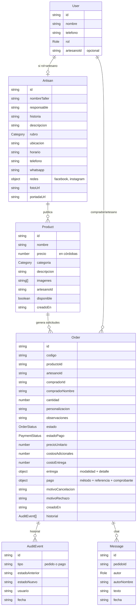
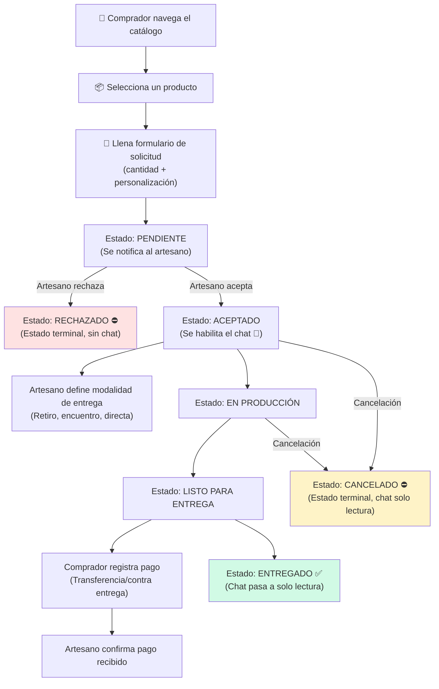
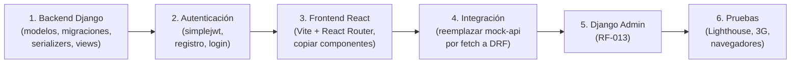

# Auditoría Técnica — Prototipo "Artesanica" (masaya-artisan-connect)

> **Auditor:** Análisis automatizado por IA  
> **Fecha:** 14 de agosto de 2026  
> **Alcance:** Revisión completa del código fuente del prototipo funcional, sin modificación alguna de archivos.  
> **Proyecto:** "Propuesta de un sistema e-commerce para la comercialización de productos artesanales de las PYMEs en Masaya, Nicaragua" — Tesis de grado, Universidad Nacional de Ingeniería (UNI).

---

## Resumen Ejecutivo

El prototipo es una **aplicación frontend completa** construida con TanStack Start (React + SSR) y datos simulados en memoria (*mock API*). **No posee backend real, base de datos ni autenticación verdadera** — esto es coherente con su naturaleza de prototipo de validación de UI/UX generado en la plataforma Lovable. El modelo de datos y la máquina de estados del pedido están notablemente bien diseñados: reflejan con fidelidad el modelo de negocio de fabricación bajo demanda, con estados de pedido y de pago explícitamente separados, chat condicionado al estado del pedido, y trazabilidad de eventos. De los 16 RF y 10 RNF congelados, **13 RF están implementados o parcialmente implementados a nivel de interfaz**, y los RNF de usabilidad y responsividad tienen buena cobertura. Los principales vacíos son la ausencia de un panel de administración (RF-013), la falta de compresión real de imágenes (RF-002), y la autenticación puramente simulada (RF-004). La migración al stack final (Django + DRF + React + SQL Server) requerirá reescribir toda la capa de datos/servicios y la autenticación, pero la interfaz de usuario, los componentes, la máquina de estados y los flujos de interacción pueden reutilizarse significativamente.

---

## 1. Estructura General del Proyecto

### 1.1 Árbol de Carpetas y Archivos

```text
masaya-artisan-connect/
├── .lovable/                        # Metadatos de la plataforma Lovable
│   ├── project.json
│   └── plan/
│       └── prototipo-frontend-artesanías-de-masaya-barro-y-sombra-2026-08-12.md
├── public/                          # Archivos estáticos servidos directamente
│   ├── favicon.ico
│   └── robots.txt
├── src/
│   ├── assets/                      # Imágenes estáticas del sistema (8 archivos .jpg)
│   │   ├── cat-cuero.jpg, cat-dulces.jpg, cat-hamacas.jpg, ...
│   │   ├── hero-masaya.jpg
│   │   └── taller.jpg
│   ├── components/
│   │   ├── catalogo/                # Tarjetas visuales de producto y artesano
│   │   │   ├── artisan-card.tsx
│   │   │   └── product-card.tsx
│   │   ├── common/                  # Utilidades compartidas (selector de moneda, estados vacío/error)
│   │   │   ├── currency-switcher.tsx
│   │   │   └── states.tsx
│   │   ├── layout/                  # Estructura general del sitio (header, footer, menú)
│   │   │   └── site-layout.tsx
│   │   ├── pedidos/                 # Componentes de gestión de pedidos
│   │   │   ├── order-chat.tsx       # Chat asociado al pedido con polling
│   │   │   ├── status-badges.tsx    # Etiquetas de estado (pedido y pago)
│   │   │   └── timelines.tsx        # Línea de tiempo y auditoría
│   │   ├── productos/               # Componentes de gestión de productos
│   │   │   └── image-uploader.tsx   # Subida simulada de fotografías
│   │   └── ui/                      # 46 componentes base de shadcn/ui (botones, modales, tablas…)
│   ├── data/
│   │   └── seed.ts                  # Datos semilla: 50 artesanos, 500 productos, pedidos, mensajes
│   ├── hooks/
│   │   ├── use-currency.tsx         # Contexto global de moneda (NIO/USD)
│   │   ├── use-mobile.tsx           # Detección de dispositivo móvil
│   │   ├── use-notifications.tsx    # Sistema de notificaciones por polling
│   │   └── use-session.tsx          # Sesión simulada (sin autenticación real)
│   ├── lib/
│   │   ├── error-capture.ts         # Captura de errores para Lovable
│   │   ├── error-page.ts            # Página de error HTML
│   │   ├── format.ts                # Formateo de precios, fechas y tasa de cambio
│   │   ├── lovable-error-reporting.ts # Reportes de error a Lovable
│   │   ├── order-state.ts           # ★ Máquina de estados: pedido, pago y chat
│   │   └── utils.ts                 # Utilidad `cn()` para combinar clases CSS
│   ├── routes/                      # Páginas (enrutamiento basado en archivos de TanStack Router)
│   │   ├── __root.tsx               # Raíz: proveedores globales
│   │   ├── index.tsx                # Página de inicio (landing)
│   │   ├── auth.tsx                 # Ingreso / registro simulado
│   │   ├── catalogo.tsx             # Catálogo con filtros y búsqueda
│   │   ├── producto.$id.tsx         # Ficha detallada de producto
│   │   ├── artesano.$id.tsx         # Perfil público del artesano
│   │   ├── solicitar.$productId.tsx # Formulario de solicitud de pedido
│   │   ├── pedidos.index.tsx        # Lista de pedidos del comprador
│   │   ├── pedidos.$id.tsx          # Detalle del pedido (vista comprador)
│   │   ├── mensajes.tsx             # Bandeja de mensajes por pedido
│   │   ├── panel.index.tsx          # Dashboard del artesano
│   │   ├── panel.pedidos.index.tsx  # Lista de pedidos del artesano
│   │   ├── panel.pedidos.$id.tsx    # Gestión del pedido (vista artesano)
│   │   ├── panel.productos.tsx      # CRUD de productos del artesano
│   │   └── panel.perfil.tsx         # Edición del perfil del taller
│   ├── services/
│   │   └── mock-api.ts              # ★ API simulada: CRUD completo en memoria
│   ├── types/
│   │   └── index.ts                 # ★ Todas las interfaces y tipos del dominio
│   ├── router.tsx                   # Inicialización del router y QueryClient
│   ├── routeTree.gen.ts             # Generado automáticamente por TanStack
│   ├── server.ts                    # Servidor SSR (Nitro/H3)
│   ├── start.ts                     # Punto de entrada SSR con middlewares
│   └── styles.css                   # Sistema de diseño "Barro y Sombra" (tokens oklch)
├── .gitignore
├── .prettierrc / .prettierignore
├── AGENTS.md                        # Instrucciones del entorno Lovable
├── README.md                        # Documentación extensa del prototipo
├── bun.lock / bunfig.toml           # Gestor de paquetes Bun
├── components.json                  # Configuración shadcn/ui
├── eslint.config.js
├── package.json
├── tsconfig.json
└── vite.config.ts
```

### 1.2 Descripción de Carpetas Clave

| Carpeta / Archivo | Qué hace |
|---|---|
| `src/types/index.ts` | Define TODAS las entidades del sistema (User, Artisan, Product, Order, Message) y sus tipos asociados (estados de pedido, pago, entrega). Es el "diccionario de datos" del prototipo. |
| `src/lib/order-state.ts` | Contiene la **máquina de estados** del pedido y del pago: qué transiciones son válidas, cuándo se puede cancelar, y cuándo se habilita/deshabilita el chat. Es el archivo más importante del dominio de negocio. |
| `src/services/mock-api.ts` | Simula una API REST completa. Todas las operaciones (crear producto, solicitar pedido, cambiar estado, registrar pago, enviar mensaje) se ejecutan contra un almacén en memoria. |
| `src/data/seed.ts` | Genera datos de demostración deterministas: 50 artesanos, 500 productos, 8 pedidos en distintos estados y mensajes de ejemplo. |
| `src/hooks/` | Contextos globales de React para sesión, moneda, notificaciones y detección de dispositivo móvil. |
| `src/routes/` | Cada archivo `.tsx` equivale a una página/pantalla de la aplicación. El enrutamiento es automático por nombre de archivo. |
| `src/components/ui/` | 46 componentes genéricos de interfaz (botones, modales, formularios, tablas…) proporcionados por la librería shadcn/ui. No contienen lógica de negocio. |

---

## 2. Stack Real Detectado

### 2.1 Tecnologías del Prototipo

| Capa | Tecnología | Versión |
|---|---|---|
| **Lenguaje** | TypeScript (strict mode) | 5.8.3 |
| **Framework UI** | React | 19.2.0 |
| **Meta-framework / SSR** | TanStack Start + TanStack Router | 1.168.32 / 1.170.18 |
| **Servidor SSR** | Nitro (beta) | 3.0.260603-beta |
| **Bundler** | Vite | 8.2.0 |
| **Estilos** | Tailwind CSS v4 | 4.2.1 |
| **Componentes UI** | shadcn/ui + Radix UI | Múltiples paquetes |
| **Data fetching** | TanStack React Query | 5.101.1 |
| **Validación** | Zod | 3.24.2 |
| **Formularios** | React Hook Form + @hookform/resolvers | 7.71.2 / 5.2.2 |
| **Gestor de paquetes** | Bun | (vía bun.lock) |
| **Backend** | ❌ **Ninguno** — datos en memoria (mock-api.ts) | — |
| **Base de datos** | ❌ **Ninguna** — store JavaScript en RAM | — |
| **Autenticación** | ❌ **Simulada** — localStorage, sin JWT ni OAuth | — |
| **Plataforma** | Lovable (generador de código asistido por IA) | @lovable.dev/vite-tanstack-config 2.12.0 |

### 2.2 Comparación con el Stack Objetivo

| Aspecto | Stack Objetivo (Tesis) | Prototipo Actual | ¿Coincide? |
|---|---|---|---|
| Backend | Python + Django + DRF | Ninguno (mock en JS) | ❌ No |
| Frontend | React | React 19 (TanStack Start) | ✅ Sí (parcial — el meta-framework difiere) |
| Base de datos | SQL Server | Store en memoria | ❌ No |
| Arquitectura | Monolítica cliente-servidor | SPA con SSR, sin servidor propio | ❌ No |
| API | REST con DRF Serializers | Funciones JavaScript simulando latencia | ❌ No |
| Autenticación | djangorestframework-simplejwt | localStorage, sesión hardcodeada | ❌ No |
| Chat | Polling sobre API REST/DRF | Polling sobre funciones mock (✅ patrón correcto) | ⚠️ Parcial |

> [!IMPORTANT]
> El prototipo es un **frontend puro** generado en Lovable. No tiene backend, base de datos, ni autenticación real. Esto es esperable para un prototipo de validación visual, pero debe documentarse claramente en la tesis como "prototipo de interfaz" — no como implementación del sistema propuesto.

---

## 3. Modelo de Datos

### 3.1 Entidades Definidas

Todas las entidades están en [index.ts](file:///c:/Users/yader/OneDrive%20-%20UNI/Escritorio/Artesanica/masaya-artisan-connect/src/types/index.ts):



### 3.2 Tipos Enumerados

| Tipo | Valores | Archivo |
|---|---|---|
| `Category` | "Cuero y calzado", "Hamacas", "Madera", "Textiles", "Dulces", "Otros" | [index.ts:L1-10](file:///c:/Users/yader/OneDrive%20-%20UNI/Escritorio/Artesanica/masaya-artisan-connect/src/types/index.ts#L1-L10) |
| `Role` | "comprador", "artesano" | [index.ts:L12](file:///c:/Users/yader/OneDrive%20-%20UNI/Escritorio/Artesanica/masaya-artisan-connect/src/types/index.ts#L12) |
| `OrderStatus` | "Pendiente", "Aceptado", "En producción", "Listo para entrega", "Entregado", "Rechazado", "Cancelado" | [index.ts:L50-59](file:///c:/Users/yader/OneDrive%20-%20UNI/Escritorio/Artesanica/masaya-artisan-connect/src/types/index.ts#L50-L59) |
| `PaymentStatus` | "Pendiente de pago", "Pago registrado", "Pago confirmado" | [index.ts:L61-66](file:///c:/Users/yader/OneDrive%20-%20UNI/Escritorio/Artesanica/masaya-artisan-connect/src/types/index.ts#L61-L66) |
| `DeliveryMode` | "Retiro en taller", "Punto de encuentro", "Entrega directa por el artesano", "Otra" | [index.ts:L68-72](file:///c:/Users/yader/OneDrive%20-%20UNI/Escritorio/Artesanica/masaya-artisan-connect/src/types/index.ts#L68-L72) |
| `PaymentMethod` | "Transferencia", "Pago contra entrega", "Otro método" | [index.ts:L74](file:///c:/Users/yader/OneDrive%20-%20UNI/Escritorio/Artesanica/masaya-artisan-connect/src/types/index.ts#L74) |

### 3.3 Evaluación del Modelo vs. Negocio

> [!TIP]
> **El modelo de datos refleja correctamente el negocio.** Puntos destacados:

- ✅ El pedido (`Order`) tiene **dos campos de estado independientes**: `estado` (flujo logístico) y `estadoPago` (flujo financiero), exactamente como requiere el RF-010.
- ✅ El historial (`AuditEvent[]`) embebido en cada pedido distingue entre eventos de tipo `"pedido"` y `"pago"`, lo que cumple con RNF-008.
- ✅ Los estados terminales (`Rechazado`, `Cancelado`) están correctamente separados, y ambos incluyen campo de motivo.
- ✅ La entrega es un objeto opcional (`DeliveryMode` + detalle texto libre), coherente con RF-016.
- ✅ El pago incluye método, referencia y nombre de comprobante, pero **no almacena datos de tarjetas ni el archivo del comprobante** (solo un nombre simbólico).
- ⚠️ **Hueco**: No existe una entidad `Admin` ni un rol de administrador en el tipo `Role`. Solo existen "comprador" y "artesano".

---

## 4. Flujos y Lógica de Negocio Implementados

### 4.1 Pantallas Existentes

| Ruta | Pantalla | Rol | Qué hace |
|---|---|---|---|
| `/` | Landing page | Público | Muestra hero, categorías, productos y talleres destacados, sección "Cómo funciona" |
| `/auth` | Acceso | Público | Selección de rol (comprador/artesano), ingreso y registro simulado por teléfono + contraseña |
| `/catalogo` | Catálogo | Público | Cuadrícula de productos con filtros (categoría, precio, artesano), búsqueda de texto, paginación |
| `/producto/$id` | Ficha de producto | Público | Detalle del producto, galería de imágenes, precio dual (C$/US$), enlace al taller, botón "Solicitar pedido" |
| `/artesano/$id` | Perfil público del artesano | Público | Historia, rubro, ubicación, horario, teléfono, WhatsApp, redes sociales, productos publicados |
| `/solicitar/$productId` | Formulario de solicitud | Comprador | Cantidad (1-50), personalización (obligatoria), observaciones, resumen con total estimado |
| `/pedidos` | Mis pedidos | Comprador | Lista de pedidos del comprador con filtro por estado |
| `/pedidos/$id` | Detalle del pedido | Comprador | Timeline, chat, montos, registro de pago, cancelación |
| `/mensajes` | Bandeja de mensajes | Ambos | Lista de conversaciones por pedido, chat integrado |
| `/panel` | Dashboard del artesano | Artesano | Métricas (pendientes, activos, pagos, productos), pedidos recientes |
| `/panel/pedidos` | Pedidos del artesano | Artesano | Lista de todos los pedidos recibidos con filtro por estado |
| `/panel/pedidos/$id` | Gestión del pedido | Artesano | Aceptar/rechazar, avanzar estado, definir entrega, confirmar pago, chat |
| `/panel/productos` | Mis productos | Artesano | CRUD de productos (crear, editar con formulario modal, listar) |
| `/panel/perfil` | Perfil del taller | Artesano | Formulario para editar datos públicos del taller |

### 4.2 Flujo Completo de un Pedido (Historia de Usuario)



**Narración paso a paso:**

1. **Exploración**: El comprador llega a la landing page, explora categorías o usa el catálogo con filtros.
2. **Selección**: Al ver un producto, entra a su ficha detallada donde puede ver el precio en córdobas o dólares.
3. **Solicitud** (RF-009): Desde la ficha, presiona "Solicitar pedido" y llena cantidad, personalización y observaciones. El sistema genera un pedido en estado **Pendiente**.
4. **Evaluación** (RF-005): El artesano ve la solicitud en su panel y decide **Aceptar** o **Rechazar**. Si rechaza, debe indicar un motivo; el pedido pasa a estado terminal y no se crea chat.
5. **Producción** (RF-010): Si acepta, el pedido pasa a **Aceptado**, se habilita el chat (RF-014) y el artesano puede avanzar a **En producción** y luego a **Listo para entrega**.
6. **Pago** (RF-011): El comprador registra el pago (método + referencia). El artesano confirma la recepción. Esto es **independiente** del avance del pedido.
7. **Entrega** (RF-016): El artesano define la modalidad y detalles de entrega en cualquier momento tras aceptar.
8. **Cierre**: Al marcar **Entregado**, el pedido se cierra y el chat pasa a solo lectura.
9. **Cancelación** (RF-015): En cualquier momento entre Aceptado y En producción, cualquiera puede cancelar el pedido.

---

## 5. Cobertura de Requisitos

### 5.1 Requisitos Funcionales (RF-001 a RF-016)

| RF | Nombre | Estado | Evidencia | Observaciones |
|---|---|---|---|---|
| **RF-001** | Carga simplificada de productos | ✅ **Implementado** | [panel.productos.tsx:L39-50](file:///c:/Users/yader/OneDrive%20-%20UNI/Escritorio/Artesanica/masaya-artisan-connect/src/routes/panel.productos.tsx#L39-L50) — Formulario con 4 campos: nombre, precio, categoría (rubro) y descripción + imagen. Validación con Zod. | El formulario solicita exactamente los campos requeridos. La fotografía es un campo adicional gestionado por `ImageUploader`. Cumple el objetivo de baja carga cognitiva. |
| **RF-002** | Optimización y almacenamiento de imágenes | ⚠️ **Parcialmente implementado** | [mock-api.ts:L214-230](file:///c:/Users/yader/OneDrive%20-%20UNI/Escritorio/Artesanica/masaya-artisan-connect/src/services/mock-api.ts#L214-L230) — `processImage()` valida tipo y tamaño (máx 5 MB) pero **solo convierte a Base64/DataURL**, no comprime realmente. | No hay compresión real de imagen ni almacenamiento en sistema de archivos. La imagen se guarda como string Base64 en el store de memoria. En la versión final con Django, debe usarse `ImageField` + procesamiento con Pillow para compresión, y almacenar en el filesystem del servidor. |
| **RF-003** | Categorización por rubro local | ✅ **Implementado** | [index.ts:L1-10](file:///c:/Users/yader/OneDrive%20-%20UNI/Escritorio/Artesanica/masaya-artisan-connect/src/types/index.ts#L1-L10) — `CATEGORIES`: "Cuero y calzado", "Hamacas", "Madera", "Textiles", "Dulces", "Otros". Usadas como filtro en el catálogo y selector en el formulario de productos. | Los rubros coinciden exactamente con los especificados en el requisito. La categoría "Otros" da flexibilidad. |
| **RF-004** | Autenticación simplificada | ⚠️ **Parcialmente implementado** | [auth.tsx](file:///c:/Users/yader/OneDrive%20-%20UNI/Escritorio/Artesanica/masaya-artisan-connect/src/routes/auth.tsx) — Formularios de ingreso y registro con teléfono + contraseña + selección de rol. Valida formato de teléfono nicaragüense (8 dígitos). [use-session.tsx](file:///c:/Users/yader/OneDrive%20-%20UNI/Escritorio/Artesanica/masaya-artisan-connect/src/hooks/use-session.tsx) — Sesión en localStorage. | La interfaz del formulario es correcta (teléfono + contraseña como MVP). Sin embargo, **no hay autenticación real**: los datos del formulario se ignoran y se carga un usuario hardcodeado (líneas 13-26 de use-session.tsx). No hay JWT, no hay validación de credenciales, no hay registro persistente. Es puramente visual. |
| **RF-005** | Evaluación: Aceptar/Rechazar | ✅ **Implementado** | [panel.pedidos.$id.tsx:L96-289](file:///c:/Users/yader/OneDrive%20-%20UNI/Escritorio/Artesanica/masaya-artisan-connect/src/routes/panel.pedidos.$id.tsx#L96-L289) — Botón "Aceptar solicitud", diálogo de rechazo con motivo obligatorio (mín. 5 caracteres). [order-state.ts:L12-19](file:///c:/Users/yader/OneDrive%20-%20UNI/Escritorio/Artesanica/masaya-artisan-connect/src/lib/order-state.ts#L12-L19) — `TRANSITIONS`: Pendiente → [Aceptado, Rechazado]. | Rechazado es un estado terminal (sin transiciones posibles). El chat NO se crea si el pedido es rechazado (chatMode retorna "none"). Cumple completamente el RF. |
| **RF-006** | Resumen económico del pedido | ✅ **Implementado** | [pedidos.$id.tsx:L236-261](file:///c:/Users/yader/OneDrive%20-%20UNI/Escritorio/Artesanica/masaya-artisan-connect/src/routes/pedidos.$id.tsx#L236-L261) — Sección "Montos" con desglose: Producto × cantidad, costos adicionales, entrega, total. También en la solicitud: [solicitar.$productId.tsx:L238-255](file:///c:/Users/yader/OneDrive%20-%20UNI/Escritorio/Artesanica/masaya-artisan-connect/src/routes/solicitar.$productId.tsx#L238-L255). | El desglose incluye precio unitario × cantidad, costos adicionales y costo de entrega, con total calculado. No se define comisión de plataforma, coherente con lo especificado. |
| **RF-007** | Conversión de divisas | ✅ **Implementado** | [format.ts:L1-15](file:///c:/Users/yader/OneDrive%20-%20UNI/Escritorio/Artesanica/masaya-artisan-connect/src/lib/format.ts#L1-L15) — `TASA_CAMBIO = 36.8` (hardcodeada). [currency-switcher.tsx](file:///c:/Users/yader/OneDrive%20-%20UNI/Escritorio/Artesanica/masaya-artisan-connect/src/components/common/currency-switcher.tsx) — Toggle NIO/USD. [use-currency.tsx](file:///c:/Users/yader/OneDrive%20-%20UNI/Escritorio/Artesanica/masaya-artisan-connect/src/hooks/use-currency.tsx) — Contexto global. | Tasa hardcodeada como constante (no configurable por admin aún). En la ficha del producto se muestra explícitamente "Tasa simulada: 1 US$ = C$ 36.8". No depende de servicios externos, cumple la especificación. Falta que la tasa sea configurable por el administrador en la versión final. |
| **RF-008** | Perfil de artesano/taller | ✅ **Implementado** | [artesano.$id.tsx](file:///c:/Users/yader/OneDrive%20-%20UNI/Escritorio/Artesanica/masaya-artisan-connect/src/routes/artesano.$id.tsx) — Perfil público. [panel.perfil.tsx](file:///c:/Users/yader/OneDrive%20-%20UNI/Escritorio/Artesanica/masaya-artisan-connect/src/routes/panel.perfil.tsx) — Formulario de edición. [index.ts:L22-36](file:///c:/Users/yader/OneDrive%20-%20UNI/Escritorio/Artesanica/masaya-artisan-connect/src/types/index.ts#L22-L36) — Interface `Artisan`. | Campos: nombre del taller, responsable, historia, descripción, rubro, ubicación, horario, teléfono, WhatsApp, Facebook, Instagram, foto y portada. Edición con validación Zod. Cumple completamente. |
| **RF-009** | Solicitud de pedido personalizado | ✅ **Implementado** | [solicitar.$productId.tsx](file:///c:/Users/yader/OneDrive%20-%20UNI/Escritorio/Artesanica/masaya-artisan-connect/src/routes/solicitar.$productId.tsx) — Formulario con cantidad, personalización (obligatoria, mín. 10 chars) y observaciones. [mock-api.ts:L259-301](file:///c:/Users/yader/OneDrive%20-%20UNI/Escritorio/Artesanica/masaya-artisan-connect/src/services/mock-api.ts#L259-L301) — `createOrderRequest()`. | Se inicia desde la ficha del producto. Genera un pedido en estado Pendiente con historial inicial. El comprador entiende claramente que es una solicitud, no una compra (texto explícito en la UI). |
| **RF-010** | Seguimiento y cambio de estado | ✅ **Implementado** | [order-state.ts](file:///c:/Users/yader/OneDrive%20-%20UNI/Escritorio/Artesanica/masaya-artisan-connect/src/lib/order-state.ts) — Máquina de estados completa. [mock-api.ts:L324-340](file:///c:/Users/yader/OneDrive%20-%20UNI/Escritorio/Artesanica/masaya-artisan-connect/src/services/mock-api.ts#L324-L340) — `changeOrderStatus()` valida transiciones. [timelines.tsx](file:///c:/Users/yader/OneDrive%20-%20UNI/Escritorio/Artesanica/masaya-artisan-connect/src/components/pedidos/timelines.tsx) — Visualización. | Flujo: Pendiente → Aceptado → En producción → Listo para entrega → Entregado. Rechazado y Cancelado son terminales. El estado de pago NO bloquea el avance del pedido (verificado: no hay validación de `estadoPago` en `changeOrderStatus`). Cumple completamente. |
| **RF-011** | Registro y confirmación de pago | ✅ **Implementado** | [pedidos.$id.tsx:L82-101](file:///c:/Users/yader/OneDrive%20-%20UNI/Escritorio/Artesanica/masaya-artisan-connect/src/routes/pedidos.$id.tsx#L82-L101) — Comprador registra pago. [panel.pedidos.$id.tsx:L107-114](file:///c:/Users/yader/OneDrive%20-%20UNI/Escritorio/Artesanica/masaya-artisan-connect/src/routes/panel.pedidos.$id.tsx#L107-L114) — Artesano confirma pago. [mock-api.ts:L349-371](file:///c:/Users/yader/OneDrive%20-%20UNI/Escritorio/Artesanica/masaya-artisan-connect/src/services/mock-api.ts#L349-L371) — `registerPayment()` y `confirmPayment()`. | Dos acciones separadas como requiere el RF. Flujo de pago independiente: Pendiente de pago → Pago registrado → Pago confirmado. Se registra método (Transferencia, contra entrega, otro), referencia y nota. No almacena datos de tarjetas. **Observación**: la UI del comprador solo muestra el formulario de pago cuando el pedido está en "Listo para entrega" (línea 137), lo cual es una restricción **más estricta** que el RF (que dice "Aceptado"). |
| RF-012 | *(No definido en requisitos)* | — | — | No existe RF-012 en la lista congelada. |
| **RF-013** | Panel de administración / Django Admin | ❌ **Ausente** | No existe ninguna pantalla, ruta ni lógica de administrador en todo el proyecto. El tipo `Role` solo define "comprador" y "artesano". | No hay panel de admin, ni CRUD de usuarios, ni moderación de productos, ni consulta de pedidos por un rol de administrador. Esto es coherente con que el prototipo simula solo los roles operativos, pero debe implementarse en la versión final vía Django Admin. |
| **RF-014** | Mensajería asociada al pedido | ✅ **Implementado** | [order-chat.tsx](file:///c:/Users/yader/OneDrive%20-%20UNI/Escritorio/Artesanica/masaya-artisan-connect/src/components/pedidos/order-chat.tsx) — Chat completo. [order-state.ts:L39-55](file:///c:/Users/yader/OneDrive%20-%20UNI/Escritorio/Artesanica/masaya-artisan-connect/src/lib/order-state.ts#L39-L55) — `chatMode()`. [mensajes.tsx](file:///c:/Users/yader/OneDrive%20-%20UNI/Escritorio/Artesanica/masaya-artisan-connect/src/routes/mensajes.tsx) — Bandeja. | • Chat habilitado solo al Aceptar (Pendiente → disabled, Rechazado → none). • Solo lectura al Entregado o Cancelado. • Polling cada 15 segundos (POLL_MS = 15000). • Solicita solo mensajes nuevos (`pollNewMessages` con timestamp `desde`). • No se puede iniciar un pedido desde el chat. Cumple completamente las reglas del RF-014. |
| **RF-015** | Cancelación de pedido tras aceptación | ✅ **Implementado** | [order-state.ts:L34-37](file:///c:/Users/yader/OneDrive%20-%20UNI/Escritorio/Artesanica/masaya-artisan-connect/src/lib/order-state.ts#L34-L37) — `canCancel()`: solo en Aceptado o En producción. [pedidos.$id.tsx:L104-111](file:///c:/Users/yader/OneDrive%20-%20UNI/Escritorio/Artesanica/masaya-artisan-connect/src/routes/pedidos.$id.tsx#L104-L111) y [L331-364](file:///c:/Users/yader/OneDrive%20-%20UNI/Escritorio/Artesanica/masaya-artisan-connect/src/routes/pedidos.$id.tsx#L331-L364) — Cancelación del comprador con motivo y diálogo de confirmación. | Cancelado es un estado terminal distinto de Rechazado. La cancelación no es posible desde "Listo para entrega" en adelante. El chat pasa a solo lectura al cancelar. **Observación menor**: la notificación a la otra parte se simula via toast local, no vía notificación real al artesano/comprador (limitación esperada del prototipo). |
| **RF-016** | Registro de modalidad de entrega | ✅ **Implementado** | [panel.pedidos.$id.tsx:L294-353](file:///c:/Users/yader/OneDrive%20-%20UNI/Escritorio/Artesanica/masaya-artisan-connect/src/routes/panel.pedidos.$id.tsx#L294-L353) — Formulario con selector de modalidad, detalle libre y costo. [mock-api.ts:L373-384](file:///c:/Users/yader/OneDrive%20-%20UNI/Escritorio/Artesanica/masaya-artisan-connect/src/services/mock-api.ts#L373-L384) — `setDelivery()`. | Modalidades: Retiro en taller, Punto de encuentro, Entrega directa, Otra. Incluye detalle de texto libre y costo numérico. Sin cálculo de rutas ni tracking, conforme a la especificación. |

### 5.2 Requisitos No Funcionales (RNF-001 a RNF-010)

| RNF | Nombre | Estado | Evidencia | Observaciones |
|---|---|---|---|---|
| **RNF-001** | Usabilidad | ✅ **Implementado** | [styles.css:L162-165](file:///c:/Users/yader/OneDrive%20-%20UNI/Escritorio/Artesanica/masaya-artisan-connect/src/styles.css#L162-L165) — Utilidad `touch-target` con `min-height: 44px; min-width: 44px`. Aplicada consistentemente en todos los botones. Todos los inputs tienen `className="min-h-11"` (44px). [styles.css:L54-56](file:///c:/Users/yader/OneDrive%20-%20UNI/Escritorio/Artesanica/masaya-artisan-connect/src/styles.css#L54-L56) — Tipografía "Plus Jakarta Sans" (body) y "Fraunces" (títulos). | Zonas táctiles de 44×44px, contrastes altos con paleta oklch cuidada, tipografía clara. Los mensajes de error usan `role="alert"` para accesibilidad. Las etiquetas de formulario tienen `htmlFor` vinculado. Bien implementado para el público objetivo. **No se verificó** fuentes ajustables (zoom del navegador), aunque Tailwind generalmente lo soporta. |
| **RNF-002** | Responsividad y compatibilidad móvil | ✅ **Implementado** | Todas las páginas usan clases responsive de Tailwind (`sm:`, `lg:`, `grid-cols-[...]`). [use-mobile.tsx](file:///c:/Users/yader/OneDrive%20-%20UNI/Escritorio/Artesanica/masaya-artisan-connect/src/hooks/use-mobile.tsx) — Hook de detección de móvil. [site-layout.tsx](file:///c:/Users/yader/OneDrive%20-%20UNI/Escritorio/Artesanica/masaya-artisan-connect/src/components/layout/site-layout.tsx) — Menú hamburguesa para móvil. | La interfaz se adapta de móvil a escritorio. **No se pudo verificar** el renderizado desde 360px porque no se ejecutó el proyecto, pero la arquitectura CSS lo soporta. Requiere pruebas manuales con Lighthouse en el prototipo desplegado. |
| **RNF-003** | Desempeño y carga progresiva | ⚠️ **Parcialmente implementado** | Se usa `loading="lazy"` en imágenes de productos ([panel.productos.tsx:L179](file:///c:/Users/yader/OneDrive%20-%20UNI/Escritorio/Artesanica/masaya-artisan-connect/src/routes/panel.productos.tsx#L179)). `useQuery` de TanStack carga datos asíncronamente con skeletons de carga. | Hay lazy loading en algunas imágenes y carga asíncrona de datos. Sin embargo, **los 500 productos se construyen en memoria al iniciar** ([seed.ts](file:///c:/Users/yader/OneDrive%20-%20UNI/Escritorio/Artesanica/masaya-artisan-connect/src/data/seed.ts)), lo cual infla el bundle. No se verificó el tiempo de carga en 3G simulado. La paginación del catálogo (12 items por página) mitiga esto en la UI. |
| **RNF-004** | Seguridad de pagos y datos sensibles | ⚠️ **Parcialmente implementado** | [index.ts:L74](file:///c:/Users/yader/OneDrive%20-%20UNI/Escritorio/Artesanica/masaya-artisan-connect/src/types/index.ts#L74) — No se almacenan datos de tarjetas. [mock-api.ts:L342-347](file:///c:/Users/yader/OneDrive%20-%20UNI/Escritorio/Artesanica/masaya-artisan-connect/src/services/mock-api.ts#L342-L347) — Solo se registra método, referencia y nombre del comprobante. | ✅ No se almacenan datos bancarios ni de tarjetas. ⚠️ El "comprobante" es solo un nombre de archivo (`comprobanteNombre`), **no el archivo real** — no se implementó subida de comprobantes. No hay control de acceso ni autenticación real, así que no se puede evaluar la protección de acceso a comprobantes. |
| **RNF-005** | Mantenibilidad (desacople frontend/backend) | ✅ **Implementado** (a nivel de diseño) | [mock-api.ts:L1-5](file:///c:/Users/yader/OneDrive%20-%20UNI/Escritorio/Artesanica/masaya-artisan-connect/src/services/mock-api.ts#L1-L5) — Comentario: "Puede reemplazarse por llamadas reales a Django REST Framework sin tocar la UI." Toda la UI consume funciones de `mock-api.ts` vía `useQuery/useMutation`. | La capa de servicios está **completamente aislada** en un archivo. Reemplazar las funciones mock por llamadas `fetch()` a endpoints de DRF sería un cambio limpio y localizado. La arquitectura facilita la migración. |
| **RNF-006** | Disponibilidad (95%) | ⚠️ **No verificable** | No hay infraestructura de despliegue. | Es un requisito de operación, no de código. Se evaluará cuando el sistema esté desplegado. El mock-api simula fallos aleatorios (`simularFalloProximaPeticion`) y la UI muestra estados de error con botón "Reintentar". |
| **RNF-007** | Escalabilidad (50 artesanos, 500 productos) | ✅ **Demostrado en datos mock** | [seed.ts:L118](file:///c:/Users/yader/OneDrive%20-%20UNI/Escritorio/Artesanica/masaya-artisan-connect/src/data/seed.ts#L118) — `for (let i = 0; i < 50; i++)` (artesanos). [seed.ts:L148](file:///c:/Users/yader/OneDrive%20-%20UNI/Escritorio/Artesanica/masaya-artisan-connect/src/data/seed.ts#L148) — `for (let i = 0; i < 500; i++)` (productos). | Los datos semilla generan exactamente 50 artesanos y 500 productos, cumpliendo los umbrales de prueba. Sin embargo, la escalabilidad real dependerá del backend con SQL Server y las consultas optimizadas. |
| **RNF-008** | Trazabilidad: pedidos, pagos y mensajería | ✅ **Implementado** | [index.ts:L76-83](file:///c:/Users/yader/OneDrive%20-%20UNI/Escritorio/Artesanica/masaya-artisan-connect/src/types/index.ts#L76-L83) — `AuditEvent` con tipo (pedido/pago), estados anterior/nuevo, usuario, fecha. [timelines.tsx](file:///c:/Users/yader/OneDrive%20-%20UNI/Escritorio/Artesanica/masaya-artisan-connect/src/components/pedidos/timelines.tsx) — `AuditTimeline` muestra historial cronológico. | Cada cambio de estado del pedido y del pago genera un `AuditEvent` con estado anterior, estado nuevo, usuario y fecha ISO. El historial de mensajes se mantiene asociado al pedido. Cumple completamente el RNF. |
| **RNF-009** | Compatibilidad de navegadores de escritorio | ⚠️ **No verificable** | React 19 + Vite 8 + Tailwind v4 son tecnologías modernas compatibles con Chrome, Firefox y Edge actuales. | No se pudo ejecutar pruebas cruzadas. La arquitectura tecnológica sugiere compatibilidad, pero requiere verificación manual. |
| **RNF-010** | Eficiencia en consumo de datos / Polling | ✅ **Implementado** | [order-chat.tsx:L13](file:///c:/Users/yader/OneDrive%20-%20UNI/Escritorio/Artesanica/masaya-artisan-connect/src/components/pedidos/order-chat.tsx#L13) — `POLL_MS = 15000` (15 segundos). [use-notifications.tsx:L17](file:///c:/Users/yader/OneDrive%20-%20UNI/Escritorio/Artesanica/masaya-artisan-connect/src/hooks/use-notifications.tsx#L17) — `POLL_MS = 20000` (20 segundos). [mock-api.ts:L418-438](file:///c:/Users/yader/OneDrive%20-%20UNI/Escritorio/Artesanica/masaya-artisan-connect/src/services/mock-api.ts#L418-L438) — `pollNewMessages()` filtra por `fecha > desde`. | El chat hace polling cada 15 seg y las notificaciones cada 20 seg, ambos ≥ 10 seg. Cada sondeo solicita **únicamente mensajes nuevos** (no la conversación completa). Cumple completamente. |

---

## 6. Hallazgos Técnicos y Riesgos

> [!WARNING]
> Los siguientes hallazgos se reportan estrictamente con fines informativos. Ningún archivo fue modificado.

### 6.1 Seguridad

| # | Hallazgo | Severidad | Detalle |
|---|---|---|---|
| S-1 | **Sin autenticación real** | 🔴 Crítico | La sesión es un objeto hardcodeado en [use-session.tsx:L13-26](file:///c:/Users/yader/OneDrive%20-%20UNI/Escritorio/Artesanica/masaya-artisan-connect/src/hooks/use-session.tsx#L13-L26). Cualquier usuario puede actuar como comprador o artesano sin validar credenciales. En la versión final, Django+simplejwt resolverá esto. |
| S-2 | **No hay control de acceso a rutas** | 🔴 Crítico | Todas las rutas del panel del artesano (`/panel/*`) son accesibles sin autenticación. No hay middleware ni guard que verifique el rol. |
| S-3 | **Comprobantes de pago: solo nombre, sin archivo** | 🟡 Medio | El campo `comprobanteNombre` almacena solo el nombre del archivo (string), no el archivo real. No hay subida de archivos, ni almacenamiento, ni control de acceso. Relevante para RNF-004. |
| S-4 | **Sesión en localStorage sin cifrado** | 🟡 Medio | Los datos de la sesión se guardan en texto plano en localStorage, accesibles desde la consola del navegador. |

### 6.2 Código y Arquitectura

| # | Hallazgo | Severidad | Detalle |
|---|---|---|---|
| C-1 | **Datos semilla se cargan al inicio** | 🟡 Medio | [seed.ts](file:///c:/Users/yader/OneDrive%20-%20UNI/Escritorio/Artesanica/masaya-artisan-connect/src/data/seed.ts) genera 50 artesanos + 500 productos en cada carga de la aplicación. Esto infla el bundle de JavaScript y aumenta el tiempo de arranque. Aceptable para un prototipo, pero no para producción. |
| C-2 | **Archivos específicos de Lovable** | 🟢 Bajo | [lovable-error-reporting.ts](file:///c:/Users/yader/OneDrive%20-%20UNI/Escritorio/Artesanica/masaya-artisan-connect/src/lib/lovable-error-reporting.ts) y [error-capture.ts](file:///c:/Users/yader/OneDrive%20-%20UNI/Escritorio/Artesanica/masaya-artisan-connect/src/lib/error-capture.ts) son específicos de la plataforma Lovable y no serán necesarios en la versión final. |
| C-3 | **Mensajes simulados en el polling** | 🟢 Bajo | [mock-api.ts:L424-436](file:///c:/Users/yader/OneDrive%20-%20UNI/Escritorio/Artesanica/masaya-artisan-connect/src/services/mock-api.ts#L424-L436) — `pollNewMessages()` genera aleatoriamente mensajes falsos del artesano (45% de probabilidad en cada poll) para demostrar el polling. Esto es correcto para el prototipo pero no debe existir en producción. |
| C-4 | **Pago restringido a "Listo para entrega"** | 🟡 Medio | [pedidos.$id.tsx:L137](file:///c:/Users/yader/OneDrive%20-%20UNI/Escritorio/Artesanica/masaya-artisan-connect/src/routes/pedidos.$id.tsx#L137) — `puedePagar = o.estado === "Listo para entrega" && o.estadoPago === "Pendiente de pago"`. El RF-011 indica que el pago se registra para un pedido **"Aceptado"**, no exclusivamente "Listo para entrega". Esta restricción es **más estricta** que lo especificado. |
| C-5 | **El artesano no puede cancelar desde la UI** | 🟡 Medio | La máquina de estados permite cancelar desde Aceptado o En producción ([order-state.ts:L14-15](file:///c:/Users/yader/OneDrive%20-%20UNI/Escritorio/Artesanica/masaya-artisan-connect/src/lib/order-state.ts#L14-L15)), pero la vista del artesano ([panel.pedidos.$id.tsx:L147](file:///c:/Users/yader/OneDrive%20-%20UNI/Escritorio/Artesanica/masaya-artisan-connect/src/routes/panel.pedidos.$id.tsx#L147)) filtra "Cancelado" de las transiciones visibles: `.filter((s) => s !== "Cancelado")`. El RF-015 indica que la cancelación debe ser posible "a solicitud del artesano o del comprador". |
| C-6 | **ID de pedido generado con `Date.now()`** | 🟢 Bajo | [mock-api.ts:L272](file:///c:/Users/yader/OneDrive%20-%20UNI/Escritorio/Artesanica/masaya-artisan-connect/src/services/mock-api.ts#L272) — Colisiones poco probables en el prototipo, pero en producción se usarían UUIDs o IDs secuenciales de base de datos. |

### 6.3 UX y Diseño

| # | Hallazgo | Severidad | Detalle |
|---|---|---|---|
| U-1 | **Sistema de diseño cuidado** | ✅ Positivo | La paleta "Barro y Sombra" en [styles.css](file:///c:/Users/yader/OneDrive%20-%20UNI/Escritorio/Artesanica/masaya-artisan-connect/src/styles.css) usa colores oklch temáticos (terracota, verde oliva, crema cálido, mostaza) con modo oscuro completo. Tipografía "Plus Jakarta Sans" + "Fraunces". Muy apropiado para la identidad artesanal de Masaya. |
| U-2 | **Lenguaje contextualizado** | ✅ Positivo | Toda la interfaz está en español nicaragüense: "córdobas", barrios de Masaya, categorías locales, nombres nicaragüenses, formato de teléfono de 8 dígitos. |
| U-3 | **Esqueletos de carga** | ✅ Positivo | Todas las páginas tienen componentes `Skeleton` que muestran la estructura visual mientras se cargan los datos, mejorando la percepción de velocidad. |

---

## 7. Recomendaciones para la Migración al Stack Final

### 7.1 Partes Reutilizables del Prototipo

| Elemento | Reutilizable | Cómo aprovecharlo |
|---|---|---|
| **Modelo de datos** ([types/index.ts](file:///c:/Users/yader/OneDrive%20-%20UNI/Escritorio/Artesanica/masaya-artisan-connect/src/types/index.ts)) | ✅ Alta | Las interfaces TypeScript son una referencia directa para definir los modelos de Django (`models.py`). Los campos, relaciones y tipos enumerados ya están especificados. |
| **Máquina de estados** ([order-state.ts](file:///c:/Users/yader/OneDrive%20-%20UNI/Escritorio/Artesanica/masaya-artisan-connect/src/lib/order-state.ts)) | ✅ Alta | Las transiciones, reglas de cancelación y modos del chat pueden traducirse directamente a la lógica de Django (decoradores o métodos del modelo `Order`). También puede mantenerse una copia en el frontend para validación optimista. |
| **Componentes de UI** (`src/components/`) | ✅ Alta | Todos los componentes visuales (tarjetas, badges, timelines, chat, formularios) pueden reutilizarse en la app React final con mínimas modificaciones, cambiando solo la fuente de datos. |
| **Sistema de diseño** ([styles.css](file:///c:/Users/yader/OneDrive%20-%20UNI/Escritorio/Artesanica/masaya-artisan-connect/src/styles.css)) | ✅ Alta | La paleta de colores, tipografía y tokens CSS se pueden trasladar directamente al nuevo proyecto React. |
| **Flujos de UI / Diseño de pantallas** (`src/routes/`) | ✅ Alta | La estructura de páginas, la disposición de las secciones y los flujos de interacción son referencia directa de diseño. Solo cambia cómo se obtienen los datos. |
| **Validaciones Zod** (en cada formulario) | ✅ Alta | Los esquemas de validación de formularios son reutilizables tal cual en React. Deben complementarse con validación en el backend (serializers de DRF). |
| **Datos semilla** ([seed.ts](file:///c:/Users/yader/OneDrive%20-%20UNI/Escritorio/Artesanica/masaya-artisan-connect/src/data/seed.ts)) | ⚠️ Media | Puede adaptarse para generar fixtures o datos de prueba en Django (`manage.py loaddata`). |

### 7.2 Partes que Deben Reescribirse

| Elemento | Por qué debe reescribirse |
|---|---|
| **mock-api.ts** → **Django REST Framework** | Toda la capa de servicios debe reemplazarse por endpoints REST reales: views, serializers, queryset filters. Las funciones individuales de `mock-api.ts` mapean 1:1 con endpoints DRF. |
| **use-session.tsx** → **Autenticación JWT** | Debe implementarse con `djangorestframework-simplejwt`: registro, login por teléfono+contraseña, tokens de acceso y refresco. El frontend almacenará tokens en httpOnly cookies o en memoria. |
| **seed.ts** → **Migraciones + Fixtures SQL Server** | Los modelos Django generarán las tablas en SQL Server vía `python manage.py migrate`. Los datos de prueba serán fixtures JSON. |
| **processImage()** → **ImageField + Pillow** | La compresión debe hacerse en el servidor con Pillow (PIL). Django guardará el archivo en el filesystem y la ruta en SQL Server (`ImageField` + `MEDIA_ROOT`). |
| **TanStack Start / Router** → **React Router o equivalente** | El meta-framework TanStack Start es específico de Lovable. Para el stack objetivo, se recomienda Vite + React Router (más estándar y compatible con Django sirviendo el HTML estático). |
| **Panel de Admin** → **Django Admin** | Se configurará con `admin.site.register()` para cada modelo, con permisos específicos según el RF-013. |

### 7.3 Estrategia Sugerida de Migración



---

## 8. Preguntas Abiertas / Cosas que No Quedaron Claras

| # | Pregunta | Contexto |
|---|---|---|
| 1 | **¿El comprador debería poder registrar el pago desde el estado "Aceptado"?** | El RF-011 dice "pedido Aceptado", pero la UI actual lo restringe a "Listo para entrega" ([pedidos.$id.tsx:L137](file:///c:/Users/yader/OneDrive%20-%20UNI/Escritorio/Artesanica/masaya-artisan-connect/src/routes/pedidos.$id.tsx#L137)). Esto puede ser una decisión intencional o un desvío del requisito. |
| 2 | **¿El artesano debe poder cancelar pedidos desde su panel?** | El RF-015 indica cancelación por ambas partes, pero la UI del artesano filtra el botón de cancelación ([panel.pedidos.$id.tsx:L147](file:///c:/Users/yader/OneDrive%20-%20UNI/Escritorio/Artesanica/masaya-artisan-connect/src/routes/panel.pedidos.$id.tsx#L147)). |
| 3 | **¿La tasa de cambio debe ser configurable en esta versión?** | RF-007 especifica "tasa configurada manualmente por el administrador". El prototipo la tiene como constante (`36.8`) sin interfaz de administración. ¿Se implementará en Django Admin? |
| 4 | **¿Qué alcance tiene "subir comprobante de pago"?** | RF-011 menciona "comprobante adjunto" para transferencias. El prototipo almacena solo el nombre del archivo (`comprobanteNombre`), no el archivo real. ¿Debe implementarse la subida real del archivo (y control de acceso, RNF-004) en la versión final? |
| 5 | **¿Cómo se gestionará la aprobación de artesanos?** | RF-013 menciona "aprobar registro de nuevos artesanos" vía Django Admin. El prototipo no tiene este flujo — todo artesano está activo al crearse. |
| 6 | **¿El README del proyecto es el documento oficial para la tesis?** | El [README.md](file:///c:/Users/yader/OneDrive%20-%20UNI/Escritorio/Artesanica/masaya-artisan-connect/README.md) contiene un prompt de diseño muy detallado que parece haber sido la instrucción dada a Lovable para generar el código. ¿Este documento formará parte del capítulo de diseño, o se redactará de forma independiente? |
| 7 | **¿Se mantendrá TanStack Start o se migrará a Vite + React Router?** | TanStack Start con SSR puede ser innecesariamente complejo para un sistema que se servirá desde Django. React Router es más estándar y tiene una comunidad más amplia. |

---

> **Nota final**: Este informe documenta el estado del prototipo tal como fue encontrado el 14 de agosto de 2026. No se realizó ninguna modificación a los archivos del proyecto. Todas las observaciones son para fines de documentación académica y planificación de la migración al stack final.
